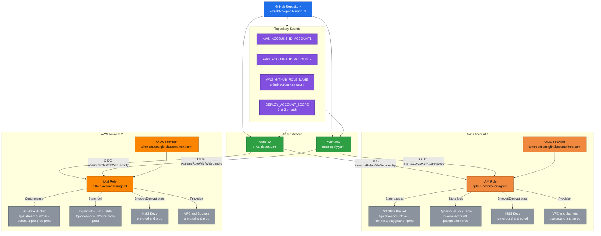

# Terraform + Terragrunt Network Baseline (Enterprise Guide)

## 1. What This Repository Does
This repository provisions AWS network infrastructure with Infrastructure as Code:
- VPC
- Subnets

It supports **4 environments across 2 AWS accounts**:
- Account 1: `playground`, `nprod`
- Account 2: `pre-prod`, `prod`

The implementation is DRY:
- Reusable Terraform modules in `modules/network/*`
- Shared Terragrunt layer in `environments/_envcommon/*`
- Environment-specific values only in `environments/<env>/*`

## Architecture Diagram (Mermaid)


High-level permissions for `github-actions-terragrunt`:
- Terraform state: S3 bucket/object read-write and bucket security configuration
- State locking: DynamoDB table create/read/write/update/delete
- Encryption: KMS encrypt/decrypt/data key operations for state
- Network provisioning: EC2 VPC/Subnet create/read/update/delete and tagging

## 2. How Remote State Is Created
Remote state resources are created by Terragrunt automatically during `init`, driven by `environments/root.hcl`.

For each environment, Terragrunt ensures:
- S3 state bucket exists
- DynamoDB lock table exists
- S3 security configuration is enforced (KMS encryption, versioning, public access block, TLS)
- DynamoDB uses on-demand billing (`PAY_PER_REQUEST`)

Naming pattern:
- S3 bucket: `tg-state-<account_id>-<region>-<environment>`
- DynamoDB table: `tg-locks-<account_id>-<environment>`

## 3. Prerequisites (Local Machine)
Install:
- Git
- AWS CLI v2
- Terraform >= 1.8
- Terragrunt >= 1.0
- TFLint
- Trivy

Verify installation:
```bash
git --version
aws --version
terraform version
terragrunt --version
tflint --version
trivy --version
```

## 4. AWS Setup: OIDC for GitHub Actions
Complete these steps in this order.

### 4.1 Create OIDC Identity Provider (once per account)
- AWS Console -> IAM -> Identity providers -> Add provider
- Provider type: `OpenID Connect`
- Provider URL: `https://token.actions.githubusercontent.com`
- Audience: `sts.amazonaws.com`

### 4.2 Create IAM Role with Custom Trust Policy (once per account)
Click `Create role` to start IAM role creation using **Custom trust policy**.

Placeholder mapping:
- `<AWS_ACCOUNT_ID>`: current AWS account where you create the role
- `<ORG_OR_USER>`: GitHub organization or GitHub user owning the repository
- `<REPO_NAME>`: GitHub repository name

How to get `<ORG_OR_USER>/<REPO_NAME>`:
- Repo URL format: `https://github.com/<ORG_OR_USER>/<REPO_NAME>`
- In this repository: `cloudsteak/poc-terragrunt`
- Or run: `git remote get-url origin`

Trust policy template:
```json
{
  "Version": "2012-10-17",
  "Statement": [
    {
      "Effect": "Allow",
      "Principal": {
        "Federated": "arn:aws:iam::<AWS_ACCOUNT_ID>:oidc-provider/token.actions.githubusercontent.com"
      },
      "Action": "sts:AssumeRoleWithWebIdentity",
      "Condition": {
        "StringEquals": {
          "token.actions.githubusercontent.com:aud": "sts.amazonaws.com",
          "token.actions.githubusercontent.com:sub": [
            "repo:<ORG_OR_USER>/<REPO_NAME>:pull_request",
            "repo:<ORG_OR_USER>/<REPO_NAME>:ref:refs/heads/main"
          ]
        }
      }
    }
  ]
}
```

Important:
- Do not use wildcard (`*`) in `token.actions.githubusercontent.com:sub`.
- Keep `aud` under `StringEquals` (no `ForAnyValue`/`ForAllValues` qualifiers).

Then click `Next` button to continue. Also click `Next` on the permissions page since we will add the inline policy in a later step.

Before you save the role, set the name to `github-actions-terragrunt` (or your preferred name, but use the same name in the next steps). Description is optional but recommended (example: `Role for GitHub Actions to deploy Terragrunt network baseline`).

Finally, click `Create role` to save. At this point the role exists and is saved.

### 4.3 Attach Permissions Policy to That Role
Find the role named `github-actions-terragrunt` in the AWS Console, open it, and go to the `Permissions` tab. Click `Add permissions` -> `Create inline policy` (JSON).

Minimum scope for this repository:
- S3 bucket/object permissions for Terraform state
- DynamoDB table permissions for state lock
- KMS permissions for state encryption key
- EC2 VPC/Subnet CRUD permissions

Starter permissions policy (tighten resources to explicit ARNs in production):
```json
{
  "Version": "2012-10-17",
  "Statement": [
    {
      "Sid": "StateS3",
      "Effect": "Allow",
      "Action": [
        "s3:CreateBucket",
        "s3:ListBucket",
        "s3:GetBucketVersioning",
        "s3:PutBucketVersioning",
        "s3:GetBucketEncryption",
        "s3:PutBucketEncryption",
        "s3:GetBucketPublicAccessBlock",
        "s3:PutBucketPublicAccessBlock",
        "s3:GetBucketPolicy",
        "s3:PutBucketPolicy",
        "s3:GetObject",
        "s3:PutObject",
        "s3:DeleteObject"
      ],
      "Resource": "*"
    },
    {
      "Sid": "StateLockDDB",
      "Effect": "Allow",
      "Action": [
        "dynamodb:DescribeTable",
        "dynamodb:CreateTable",
        "dynamodb:DeleteTable",
        "dynamodb:GetItem",
        "dynamodb:PutItem",
        "dynamodb:DeleteItem",
        "dynamodb:UpdateItem"
      ],
      "Resource": "*"
    },
    {
      "Sid": "KmsForState",
      "Effect": "Allow",
      "Action": [
        "kms:Encrypt",
        "kms:Decrypt",
        "kms:GenerateDataKey",
        "kms:DescribeKey"
      ],
      "Resource": "*"
    },
    {
      "Sid": "VpcSubnet",
      "Effect": "Allow",
      "Action": [
        "ec2:CreateVpc",
        "ec2:DeleteVpc",
        "ec2:DescribeVpcs",
        "ec2:CreateSubnet",
        "ec2:DeleteSubnet",
        "ec2:DescribeSubnets",
        "ec2:CreateTags",
        "ec2:DeleteTags",
        "ec2:DescribeAvailabilityZones"
      ],
      "Resource": "*"
    }
  ]
}
```

Click `Next`, set name `terragrunt-network-deploy`, then click `Create policy`.

At this point, you have created the role, added and saved the inline policy, and the policy is assigned to the role and ready to use.

## 5. GitHub Repository Configuration

### 5.1 Repository Secrets
Create these repository secrets:
- `AWS_ACCOUNT_ID_ACCOUNT1`
- `AWS_ACCOUNT_ID_ACCOUNT2`
- `AWS_GITHUB_ROLE_NAME`

Required secret values:
- `AWS_ACCOUNT_ID_ACCOUNT1` = account for `playground` and `nprod`
- `AWS_ACCOUNT_ID_ACCOUNT2` = account for `pre-prod` and `prod`
- `AWS_GITHUB_ROLE_NAME` = the IAM role name you created in section 4.2 (example: `github-actions-terragrunt`)

Create repository variable:
- `DEPLOY_ACCOUNT_SCOPE`

Allowed values:
- `1` = run only account 1 environments (`playground`, `nprod`)
- `2` = run only account 2 environments (`pre-prod`, `prod`)
- `both` = run all 4 environments

If `DEPLOY_ACCOUNT_SCOPE` is not set, default behavior is `both`.

### 5.2 GitHub Environments
Create exactly these environments (names must match workflow matrix values):
- `playground`
- `nprod`
- `pre-prod`
- `prod`

How to configure each environment in the current UI:
1. Open `GitHub -> Repository -> Settings -> Environments -> New environment`.
2. Create one environment name from the list above.
3. Set `Required reviewers`:
- `playground`: optional
- `nprod`: optional
- `pre-prod`: required (at least 1)
- `prod`: required (at least 2 recommended)
4. Enable `Prevent self-review` for `pre-prod` and `prod`.
5. Configure `Deployment branches and tags`:
- `playground`: select `No restriction`
- `nprod`: select `Selected branches and tags`, then add branch pattern `main`
- `pre-prod`: select `Selected branches and tags`, then add branch pattern `main`
- `prod`: select `Protected branches only` if `main` is protected; otherwise select `Selected branches and tags` and add `main`
6. Save the environment.

Why this matters:
- The workflow uses `environment: ${{ matrix.environment }}`.
- Protection rules are enforced per environment name at deployment time.

### 5.3 Actions Permissions
Repository Settings -> Actions -> General:
- Allow GitHub Actions
- Workflow permissions: `Read repository contents permission`
- Do not grant broad additional write scopes unless required

## 6. Remote Run and Validation (E2E)
At this point remote execution is possible through GitHub Actions.

### 6.1 Run PR Validation
1. Push your branch.
2. Open a pull request to `main`.
3. Open `GitHub -> Actions -> PR Validation`.
4. Wait until all expected matrix jobs finish.

Expected behavior by scope:
- `DEPLOY_ACCOUNT_SCOPE=1`: only `playground` and `nprod` run
- `DEPLOY_ACCOUNT_SCOPE=2`: only `pre-prod` and `prod` run
- `DEPLOY_ACCOUNT_SCOPE=both`: all 4 environments run

### 6.2 What to Check in PR Validation
- `Configure AWS credentials (OIDC)` succeeds in each running environment job.
- `Terragrunt plan` succeeds in each running environment job.
- No failed jobs remain in the workflow run.

### 6.3 Run Main Apply
1. Merge the PR into `main`.
2. Open `GitHub -> Actions -> Main Apply`.
3. Approve deployments in GitHub Environments if approval is required.
4. Wait for all expected jobs to complete.

### 6.4 What to Check After Main Apply
- `Terragrunt apply` succeeds in each running environment job.
- In AWS, the expected VPC and subnets exist in the target account and region.
- State resources exist: S3 bucket and DynamoDB lock table per environment.

Only continue with local execution after this remote E2E path is working.

## 7. Local Environment Variables (No Hardcoded Sensitive Metadata)
Set locally before Terragrunt commands:

```bash
export TG_AWS_ACCOUNT_ID_ACCOUNT1="<12-digit-account-id-1>"
export TG_AWS_ACCOUNT_ID_ACCOUNT2="<12-digit-account-id-2>"

export TG_STATE_KMS_KEY_ARN_PLAYGROUND="arn:aws:kms:eu-central-1:<account1>:key/<kms-key-id>"
export TG_STATE_KMS_KEY_ARN_NPROD="arn:aws:kms:eu-central-1:<account1>:key/<kms-key-id>"
export TG_STATE_KMS_KEY_ARN_PRE_PROD="arn:aws:kms:eu-central-1:<account2>:key/<kms-key-id>"
export TG_STATE_KMS_KEY_ARN_PROD="arn:aws:kms:eu-central-1:<account2>:key/<kms-key-id>"
```

Verify they are set:
```bash
env | rg '^TG_AWS_ACCOUNT_ID_|^TG_STATE_KMS_KEY_ARN_'
```

Fast setup with example script:
```bash
cp scripts/set-env.example.sh scripts/set-env.sh
# edit scripts/set-env.sh and replace placeholders
source scripts/set-env.sh
```

## 8. End-to-End Runbook (Local)

### 8.1 Format and Validate HCL
```bash
cd <repo-root>
terragrunt hcl format
terragrunt hcl validate
```

### 8.2 Validate and Plan per Environment
```bash
cd environments/playground/network
terragrunt run-all init --terragrunt-non-interactive
terragrunt run-all validate --terragrunt-non-interactive
terragrunt run-all plan --terragrunt-non-interactive
```

Repeat for:
- `environments/nprod/network`
- `environments/pre-prod/network`
- `environments/prod/network`

### 8.3 Apply per Environment
```bash
cd environments/playground/network
terragrunt run-all apply --terragrunt-non-interactive
```

Apply order recommendation:
1. `playground`
2. `nprod`
3. `pre-prod`
4. `prod`

## 9. End-to-End Verification Checklist
After apply, verify in AWS Console and CLI.

## 9.1 Verify State Backend
For each environment/account:
- S3 bucket exists with expected naming
- Versioning is enabled
- Public access block is enabled
- Default encryption is KMS
- Bucket policy enforces TLS
- DynamoDB table exists with `PAY_PER_REQUEST`

Sample CLI checks:
```bash
aws s3api get-bucket-versioning --bucket <state-bucket-name>
aws s3api get-public-access-block --bucket <state-bucket-name>
aws s3api get-bucket-encryption --bucket <state-bucket-name>
aws dynamodb describe-table --table-name <lock-table-name> --query 'Table.BillingModeSummary.BillingMode'
```

## 9.2 Verify Network Resources
- VPC exists in correct account and region
- Subnets exist with expected CIDRs and AZs
- Tags include `Environment`, `ManagedBy`, `Component`

Sample CLI checks:
```bash
aws ec2 describe-vpcs --filters "Name=tag:Environment,Values=playground"
aws ec2 describe-subnets --filters "Name=tag:Environment,Values=playground"
```

## 9.3 Verify GitHub OIDC Runtime
In GitHub Actions run logs:
- `Configure AWS credentials (OIDC)` step succeeds
- No static AWS keys are used
- Correct role ARN is assumed for each matrix environment

## 10. CI/CD Workflows

## 10.1 PR Validation (`.github/workflows/pr-validation.yaml`)
Per environment matrix:
- `terragrunt hcl format` check
- `terraform fmt -check`
- `tflint`
- `trivy config`
- `terragrunt run-all init/validate/plan`

## 10.2 Main Apply (`.github/workflows/main-apply.yaml`)
Per environment matrix:
- OIDC auth
- `terragrunt run-all init`
- `terragrunt run-all apply`

Use GitHub Environments protection for manual approvals in critical environments.

## 11. How to Extend

### 11.1 Add New Environment
1. Copy one environment folder under `environments/<new-env>`.
2. Update `env.hcl` values (region/account env var mappings).
3. Update VPC/subnet CIDRs.
4. Add new environment to workflow matrix.
5. Add GitHub Environment with approval policy.

### 11.2 Add New Module
1. Create module under `modules/network/<new-module>`.
2. Create shared wrapper in `environments/_envcommon/<new-module>.hcl`.
3. Add live stacks under each environment.
4. Wire dependencies via Terragrunt `dependency` blocks.

## 12. Security Rules You Must Keep
- Never commit secrets or account IDs directly to repository files.
- Use OIDC only for CI authentication.
- Use least privilege IAM policies.
- Keep production approvals mandatory.
- Keep state encryption and lock-table controls enabled.

## 13. Troubleshooting

### Error: missing `env.hcl` values
- Ensure required `TG_*` environment variables are exported.

### Error: access denied on S3/DynamoDB/KMS
- Fix IAM role permissions in target account.
- Confirm workflow is assuming the intended role.

### Error: OIDC assume role fails
- Verify IAM OIDC provider exists in that account.
- Verify trust policy `sub` and `aud` conditions match repo and event.

### Dependency warnings on `mock_outputs`
- Expected during HCL validation/plan bootstrap when dependency state is not created yet.

## 14. Final Acceptance Criteria
The solution is considered ready when:
1. All four environments plan successfully in GitHub PR validation.
2. Main apply succeeds with OIDC in all four environments.
3. Remote state bucket + lock table exist per environment with required security settings.
4. VPC and subnets exist with expected CIDRs/tags in correct accounts.
5. No hardcoded account IDs or secrets are present in repository code.
